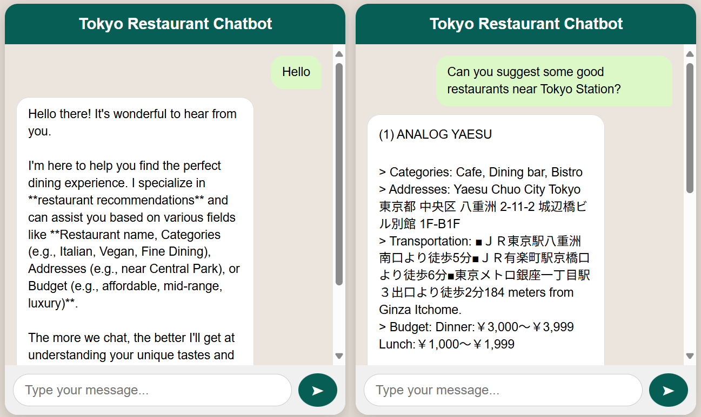

# 🤖 Restaurant Recommender Chatbot (Tokyo) 🍣

This project provides a backend API for a **restaurant recommendation chatbot** specialized in the **Tabelog Tokyo 1000 Restaurants dataset**.

* **Backend**: Built with Flask
* **AI**: Uses the Google **Gemini API** for chat generation and query classification
* **RAG**: Implements Retrieval-Augmented Generation (RAG) using pre-computed embeddings from `knowledge_base.csv`
* **Deployment**: Designed to run on **Google Cloud Run**



---

## 📦 Prerequisites

Before starting, ensure you have the following:

* A **Google Cloud Project with Billing Enabled**
* A **Gemini API Key**
* The complete project structure:

```
.
├── app.py                          # Modify RAG prompt and variable (context_columns) to fit your purpose 
├── requirements.txt
├── knowledge_base.csv              # Replace this with the data you want to use
├── knowledge_base_embedded.npy     # Generated file (automatically made from knowledge_base.csv)
├── frontend/
│   ├── index.html
│   ├── style.css
│   └── script.js
│── example_image/example.png       # Example image of chatbot interface
└── README.md
```

---

## 🚀 Deployment Steps

### 1. Install & Authenticate Google Cloud SDK

Install the **gcloud CLI** if not already installed. Then log in and set your project:

```bash
gcloud auth login
gcloud config set project YOUR_PROJECT_ID
```

Replace `YOUR_PROJECT_ID` with your actual Google Cloud Project ID.

---

### 2. Enable Required Google Cloud APIs

```bash
gcloud services enable run.googleapis.com secretmanager.googleapis.com
```

---

### 🔑 Gemini API Key Setup (Secret Manager)

Your `app.py` requires the `GEMINI_API_KEY` environment variable. We will secure this key using **Google Cloud Secret Manager**.

#### 3. Add GEMINI_API_KEY to Secrets

```bash
# Replace 'YOUR_GEMINI_API_KEY' with your actual key
echo "YOUR_GEMINI_API_KEY" | gcloud secrets create GEMINI_API_KEY --data-file=-
```

If the secret already exists:

```bash
echo "YOUR_GEMINI_API_KEY" | gcloud secrets versions add GEMINI_API_KEY --data-file=-
```

#### 4. Grant Service Account Access

Identify the Cloud Run Service Account:

```bash
PROJECT_NUMBER=$(gcloud projects describe YOUR_PROJECT_ID --format="value(projectNumber)")
SERVICE_ACCOUNT_EMAIL="${PROJECT_NUMBER}-compute@developer.gserviceaccount.com"
echo $SERVICE_ACCOUNT_EMAIL # Verify the email
```

Then give the account access:

```bash
gcloud secrets add-iam-policy-binding GEMINI_API_KEY \
  --member="serviceAccount:${SERVICE_ACCOUNT_EMAIL}" \
  --role="roles/secretmanager.secretAccessor"
```

---

## 💻 Local Development & Testing

#### 5. Test `app.py` Locally

Install dependencies:

```bash
pip install -r requirements.txt
```

Pre-calculate embeddings:

```bash
export GEMINI_API_KEY="YOUR_GEMINI_API_KEY"
python app.py
# Press Ctrl+C after seeing "✅ Embeddings saved..."
```

Run Flask locally:

```bash
export GEMINI_API_KEY="YOUR_GEMINI_API_KEY"
python app.py
```

* Base route: [http://127.0.0.1:8080/](http://127.0.0.1:8080/) → Expected: `✅ Service is running`
* Gemini test:

```bash
curl http://127.0.0.1:8080/test-gemini
```

Expected: JSON response from model.

---

## ☁️ Deploy to Google Cloud Run

#### 6. Deploy Backend

```bash
gcloud run deploy restaurant-chatbot-backend \
  --source . \
  --region us-central1 \
  --allow-unauthenticated \
  --set-env-vars=GEMINI_API_KEY=projects/YOUR_PROJECT_ID/secrets/GEMINI_API_KEY/versions/latest \
  --memory 1Gi \
  --cpu 1 \
  --port 8080 \
  --quiet
```

Note the **Service URL** upon success (your `BACKEND_URL`).

---

## ✅ Post-Deployment Testing

#### 7. Test Backend Endpoints

* Base route: Open `BACKEND_URL` → Expected: `✅ Service is running`
* Gemini connection: `BACKEND_URL/test-gemini`
* Chat endpoint:

```bash
curl -X POST BACKEND_URL/chat \
  -H "Content-Type: application/json" \
  -d '{"message": "I want a sushi restaurant in Ginza"}'
```

Expected: JSON response with recommendation + session_id.

---

## 🎨 Frontend Integration

#### 8. Update Frontend

Edit `frontend/script.js` and replace the placeholder `API_ENDPOINT` with your `BACKEND_URL`.

Run frontend locally:

```bash
cd frontend
python3 -m http.server 8000
```

Open [http://localhost:8000](http://localhost:8000) in your browser and interact with the chatbot.
Try: `"Hello"`, `"Suggest cheap ramen"`, `"Where is it?"`.

The frontend should call the Cloud Run backend and return **RAG-powered, stateful responses**.

---

## 📖 Summary

* **Backend**: Flask + Gemini API + RAG
* **Deployment**: Google Cloud Run with Secret Manager
* **Frontend**: Simple HTML/CSS/JS interface

This project enables **stateful, restaurant-focused conversations** with Tokyo’s top restaurants dataset.
